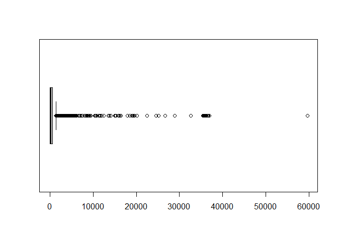

Proyecto N3
================

# Análisis de deportes de resistencia

Sebastian Herrera Cristobal Paredes

\#librerias

``` r
library(tidyverse)
```

    ## Warning: package 'tidyverse' was built under R version 4.0.5

    ## -- Attaching packages --------------------------------------- tidyverse 1.3.0 --

    ## v ggplot2 3.3.3     v purrr   0.3.4
    ## v tibble  3.1.2     v dplyr   1.0.5
    ## v tidyr   1.1.3     v stringr 1.4.0
    ## v readr   1.3.1     v forcats 0.5.0

    ## Warning: package 'ggplot2' was built under R version 4.0.4

    ## Warning: package 'tibble' was built under R version 4.0.5

    ## Warning: package 'tidyr' was built under R version 4.0.4

    ## Warning: package 'dplyr' was built under R version 4.0.4

    ## -- Conflicts ------------------------------------------ tidyverse_conflicts() --
    ## x dplyr::filter() masks stats::filter()
    ## x dplyr::lag()    masks stats::lag()

``` r
library(tidymodels)
```

    ## Warning: package 'tidymodels' was built under R version 4.0.5

    ## Registered S3 method overwritten by 'tune':
    ##   method                   from   
    ##   required_pkgs.model_spec parsnip

    ## -- Attaching packages -------------------------------------- tidymodels 0.1.3 --

    ## v broom        0.7.8      v rsample      0.1.0 
    ## v dials        0.0.9      v tune         0.1.5 
    ## v infer        0.5.4      v workflows    0.2.2 
    ## v modeldata    0.1.0      v workflowsets 0.0.2 
    ## v parsnip      0.1.6      v yardstick    0.0.8 
    ## v recipes      0.1.16

    ## Warning: package 'dials' was built under R version 4.0.5

    ## Warning: package 'scales' was built under R version 4.0.4

    ## Warning: package 'infer' was built under R version 4.0.5

    ## Warning: package 'modeldata' was built under R version 4.0.5

    ## Warning: package 'parsnip' was built under R version 4.0.5

    ## Warning: package 'recipes' was built under R version 4.0.5

    ## Warning: package 'rsample' was built under R version 4.0.5

    ## Warning: package 'tune' was built under R version 4.0.5

    ## Warning: package 'workflows' was built under R version 4.0.5

    ## Warning: package 'workflowsets' was built under R version 4.0.5

    ## Warning: package 'yardstick' was built under R version 4.0.5

    ## -- Conflicts ----------------------------------------- tidymodels_conflicts() --
    ## x scales::discard() masks purrr::discard()
    ## x dplyr::filter()   masks stats::filter()
    ## x recipes::fixed()  masks stringr::fixed()
    ## x dplyr::lag()      masks stats::lag()
    ## x yardstick::spec() masks readr::spec()
    ## x recipes::step()   masks stats::step()
    ## * Use tidymodels_prefer() to resolve common conflicts.

``` r
library(pROC)
```

    ## Warning: package 'pROC' was built under R version 4.0.5

    ## Type 'citation("pROC")' for a citation.

    ## 
    ## Attaching package: 'pROC'

    ## The following objects are masked from 'package:stats':
    ## 
    ##     cov, smooth, var

``` r
library(e1071)
```

    ## 
    ## Attaching package: 'e1071'

    ## The following object is masked from 'package:tune':
    ## 
    ##     tune

    ## The following object is masked from 'package:rsample':
    ## 
    ##     permutations

``` r
library(dplyr)
library(cluster)
```

## Cargar datos

el data frame consta de 167615 datos con 17 variables los cuales seran
almacenados en data.

``` r
  getwd()
```

    ## [1] "D:/U/mineria de datos/Proyecto 3"

``` r
  setwd("D:/U/mineria de datos")
data <- readRDS("endurance.rds")
summary(data)
```

    ##        id             type              athlete            calories       
    ##  Min.   :     1   Length:167615      Min.   : 8558143   Min.   :     0.0  
    ##  1st Qu.: 41905   Class :character   1st Qu.:14204866   1st Qu.:   281.0  
    ##  Median : 83808   Mode  :character   Median :15621719   Median :   629.0  
    ##  Mean   : 83808                      Mean   :15359426   Mean   :   816.7  
    ##  3rd Qu.:125712                      3rd Qu.:16685446   3rd Qu.:  1076.8  
    ##  Max.   :167615                      Max.   :18078075   Max.   :326157.3  
    ##     distance         elev_low           records           elev_high        
    ##  Min.   :      0   Length:167615      Length:167615      Length:167615     
    ##  1st Qu.:   6159   Class :character   Class :character   Class :character  
    ##  Median :  12968   Mode  :character   Mode  :character   Mode  :character  
    ##  Mean   :  21998                                                           
    ##  3rd Qu.:  27494                                                           
    ##  Max.   :1479320                                                           
    ##   max_speed         device_name         moving_time        elapsed_time      
    ##  Length:167615      Length:167615      Min.   :       0   Min.   :        0  
    ##  Class :character   Class :character   1st Qu.:    2248   1st Qu.:     2582  
    ##  Mode  :character   Mode  :character   Median :    3853   Median :     4450  
    ##                                        Mean   :    5141   Mean   :    32102  
    ##                                        3rd Qu.:    6516   3rd Qu.:     7934  
    ##                                        Max.   :11025474   Max.   :511111044  
    ##  average_speed      has_heartrate      start_date_local             
    ##  Length:167615      Length:167615      Min.   :1999-04-25 17:36:38  
    ##  Class :character   Class :character   1st Qu.:2016-11-23 17:11:10  
    ##  Mode  :character   Mode  :character   Median :2019-01-26 13:37:56  
    ##                                        Mean   :2018-05-12 07:50:32  
    ##                                        3rd Qu.:2020-04-30 04:33:10  
    ##                                        Max.   :2021-02-02 11:37:09  
    ##  total_elevation_gain
    ##  Min.   :    0.0     
    ##  1st Qu.:   15.1     
    ##  Median :  171.0     
    ##  Mean   :  397.0     
    ##  3rd Qu.:  595.0     
    ##  Max.   :59595.0

## Limpieza de datos

Antes de evaluar los datos hay que hacer una limpieza de
estos.eliminaremos las variables id,athlete, device\_name,
Start\_date\_local, Records y has\_heartrate

``` r
data$id <- NULL
data$athlete <- NULL
data$device_name <- NULL
data$start_date_local <- NULL
data$records <- NULL
data$has_heartrate <- NULL
```

existen variables tipo character que hay que cambiar a
numéricas.utilizaremos un buleano para definir como 1 las actividades
en bicicleta y 0 las que son a pie.

``` r
data$elev_low <- as.numeric(data$elev_low)
data$elev_high <- as.numeric(data$elev_high)
data$max_speed <- as.numeric(data$max_speed)
data$average_speed <- as.numeric(data$average_speed)
data$type_code <- (data$type == "Ride" | data$type == "EBikeRide") %>% as.numeric()
data$type <- NULL
```

a continuación buscaremos los NA

``` r
# Para las observaciones incompletas, le asignamos el valor NA para eliminarlos en el siguiente paso
data[data == ""] <- NA

# Verificamos donde hay valores NAs
data %>% 
  summarise_all(funs(sum(is.na(.))))
```

    ## Warning: `funs()` was deprecated in dplyr 0.8.0.
    ## Please use a list of either functions or lambdas: 
    ## 
    ##   # Simple named list: 
    ##   list(mean = mean, median = median)
    ## 
    ##   # Auto named with `tibble::lst()`: 
    ##   tibble::lst(mean, median)
    ## 
    ##   # Using lambdas
    ##   list(~ mean(., trim = .2), ~ median(., na.rm = TRUE))

    ##   calories distance elev_low elev_high max_speed moving_time elapsed_time
    ## 1        0        0    13519     13519         0           0            0
    ##   average_speed total_elevation_gain type_code
    ## 1             0                    0         0

``` r
# Eliminamos todas las observaciones que presenten NA
data_pre <- data %>% 
  filter(!(is.na(calories)|is.na(elev_low)|is.na(elev_high)|is.na(total_elevation_gain)))

# Corroboramos que no queden datos NA
data_pre %>% 
  summarise_all(funs(sum(is.na(.))))
```

    ##   calories distance elev_low elev_high max_speed moving_time elapsed_time
    ## 1        0        0        0         0         0           0            0
    ##   average_speed total_elevation_gain type_code
    ## 1             0                    0         0

Ademas se puede ver que existen entradas en distance con valores = 0 e
igual lo haremos con los demas datos

``` r
data_pre$distance[data_pre$distance == 0] <- NA
data_pre$calories[data_pre$calories == 0] <- NA
data_pre$elev_high[data_pre$elev_high == 0] <- NA
data_pre$elev_low[data_pre$elev_low == 0] <- NA
data_pre$total_elevation_gain[data_pre$total_elevation_gain == 0] <- NA
data_pre$moving_time[data_pre$moving_time == 0] <- NA
data_pre$elapsed_time[data_pre$elapsed_time == 0] <- NA
data_pre$average_speed[data_pre$average_speed == 0] <- NA

data_pre <- data_pre %>% filter(!(is.na(distance)|is.na(calories)|is.na(elev_high)|is.na(elev_low)|is.na(total_elevation_gain)|is.na(moving_time)|is.na(elapsed_time)|is.na(average_speed)|is.na(type_code)))
```

como sabemos que existen datos atipicos realizaremos boxplot para cada
una de las variables.

``` r
calories=boxplot(data$calories, horizontal = TRUE)
```

<!-- -->

``` r
distance=boxplot(data$distance, horizontal = TRUE)  
```

<!-- -->

``` r
elev_low=boxplot(data$elev_low, horizontal = TRUE)
```

<!-- -->

``` r
elev_high=boxplot(data$elev_high, horizontal = TRUE)
```

<!-- -->

``` r
moving_time=boxplot(data$moving_time, horizontal = TRUE)
```

<!-- -->

``` r
max_speed=boxplot(data$max_speed, horizontal = TRUE)
```

<!-- -->

``` r
elapsed_time=boxplot(data$elapsed_time, horizontal = TRUE)
```

<!-- -->

``` r
average_speed=boxplot(data$average_speed, horizontal = TRUE)
```

<!-- -->

``` r
total_elevation_gain=boxplot(data$total_elevation_gain, horizontal = TRUE)
```

<!-- -->

Los gráficos de boxplot comprueban lo mencionado acerca de la presencia
de datos atípicos en cada una de las variables, por lo que se aplicarán
filtros a cada una de estas para así eliminar las data que sean
anormales.

``` r
data_pre <- filter(data ,data$calories < 2000)
data_pre <- filter(data ,data$distance < 50000)
data_pre <- filter(data ,data$elev_low < 2000)
data_pre <- filter(data ,data$elev_low > -1000)
data_pre <- filter(data ,data$elev_high < 5000)
data_pre <- filter(data ,data$moving_time < 25000)
data_pre <- filter(data ,data$max_speed < 60)
data_pre <- filter(data ,data$elapsed_time < 15000)
data_pre <- filter(data ,data$average_speed < 30)
data_pre <- filter(data ,data$total_elevation_gain < 2000)
```

borramos …… \#escalamiento

``` r
set.seed(500)
library(rsample)
data_scal <-data.frame(scale(data_pre[0:9]))
data_scal <- cbind(data_scal,data_pre[10])
data_scal$type_code <- data_scal$type_code %>% as.factor()
datasplit <- initial_split(data_scal,prop= 0.8, strata = NULL)
data_train <- training(datasplit)
data_test <- testing(datasplit)
data_train2 <- training(datasplit)
data_test2 <- testing(datasplit)
```

\#regresion multiple utilizaremos una regresion multiple para ver cuales
son las variables mas relevantes.

``` r
library(regclass)
```

    ## Warning: package 'regclass' was built under R version 4.0.5

    ## Loading required package: bestglm

    ## Warning: package 'bestglm' was built under R version 4.0.5

    ## Loading required package: leaps

    ## Warning: package 'leaps' was built under R version 4.0.5

    ## Loading required package: VGAM

    ## Warning: package 'VGAM' was built under R version 4.0.5

    ## Loading required package: stats4

    ## Loading required package: splines

    ## 
    ## Attaching package: 'VGAM'

    ## The following object is masked from 'package:workflows':
    ## 
    ##     update_formula

    ## The following object is masked from 'package:tidyr':
    ## 
    ##     fill

    ## Loading required package: rpart

    ## 
    ## Attaching package: 'rpart'

    ## The following object is masked from 'package:dials':
    ## 
    ##     prune

    ## Loading required package: randomForest

    ## Warning: package 'randomForest' was built under R version 4.0.5

    ## randomForest 4.6-14

    ## Type rfNews() to see new features/changes/bug fixes.

    ## 
    ## Attaching package: 'randomForest'

    ## The following object is masked from 'package:dplyr':
    ## 
    ##     combine

    ## The following object is masked from 'package:ggplot2':
    ## 
    ##     margin

    ## Important regclass change from 1.3:
    ## All functions that had a . in the name now have an _
    ## all.correlations -> all_correlations, cor.demo -> cor_demo, etc.

``` r
reg_mult <- lm(type_code %>% as.numeric() ~ calories + distance + elev_low +
                 elev_high + max_speed + moving_time + elapsed_time +
                 average_speed + total_elevation_gain, data = data_scal)
summary(reg_mult)
```

    ## 
    ## Call:
    ## lm(formula = type_code %>% as.numeric() ~ calories + distance + 
    ##     elev_low + elev_high + max_speed + moving_time + elapsed_time + 
    ##     average_speed + total_elevation_gain, data = data_scal)
    ## 
    ## Residuals:
    ##      Min       1Q   Median       3Q      Max 
    ## -13.4828  -0.3204   0.0518   0.2616  15.6965 
    ## 
    ## Coefficients:
    ##                        Estimate Std. Error  t value Pr(>|t|)    
    ## (Intercept)           1.6316909  0.0009448 1726.939  < 2e-16 ***
    ## calories             -0.0581097  0.0010915  -53.239  < 2e-16 ***
    ## distance              0.0359524  0.0013983   25.711  < 2e-16 ***
    ## elev_low              0.0106777  0.0016851    6.336 2.36e-10 ***
    ## elev_high            -0.0146140  0.0018895   -7.734 1.05e-14 ***
    ## max_speed             0.3068842  0.0012469  246.116  < 2e-16 ***
    ## moving_time           0.0127487  0.0009382   13.588  < 2e-16 ***
    ## elapsed_time          0.0005077  0.0009000    0.564    0.573    
    ## average_speed         0.0134327  0.0009412   14.271  < 2e-16 ***
    ## total_elevation_gain -0.0190727  0.0014854  -12.840  < 2e-16 ***
    ## ---
    ## Signif. codes:  0 '***' 0.001 '**' 0.01 '*' 0.05 '.' 0.1 ' ' 1
    ## 
    ## Residual standard error: 0.3656 on 151535 degrees of freedom
    ##   (13519 observations deleted due to missingness)
    ## Multiple R-squared:   0.41,  Adjusted R-squared:  0.4099 
    ## F-statistic: 1.17e+04 on 9 and 151535 DF,  p-value: < 2.2e-16

``` r
VIF(reg_mult)
```

    ##             calories             distance             elev_low 
    ##             1.444496             2.306140             3.219404 
    ##            elev_high            max_speed          moving_time 
    ##             4.047755             1.662441             1.079281 
    ##         elapsed_time        average_speed total_elevation_gain 
    ##             1.000167             1.070899             2.559496

los resultados de la regresion multiple nos muestra un coeficiente de
determinacion de un 40% y se puede ver que existen variables que no son
tan significativas como elev\_low, elev\_hig, elapsed\_time

# Modelo Naive Bayes

utilizaremos el método Naive Bayes

``` r
DP_model <-  naiveBayes(type_code ~calories + distance + elev_low +
                          elev_high + max_speed + moving_time + elapsed_time +
                          average_speed + total_elevation_gain,
                        data = data_train)
```

Luego corresponde evaluar el modelo, obtener su curva ROC y
posteriormente su AUC. \#Predicciones naive bayes

``` r
PredictionModel <- predict(DP_model, newdata = data_test, type = "class") 
data_test$Predclass <- PredictionModel
curvaROC <- roc(data_test$type_code %>% as.numeric(), data_test$Predclass %>% as.numeric())
```

    ## Setting levels: control = 1, case = 2

    ## Setting direction: controls < cases

``` r
plot(curvaROC)
```

<!-- -->
\#AUC naive bayes

``` r
auc(curvaROC)
```

    ## Area under the curve: 0.7429

``` r
data_test %>% 
  conf_mat(type_code, Predclass) %>% 
  autoplot(type = "heatmap")
```

<!-- --> el
modelo nos entrega un AUC bastante bajo con un valor de de 74.29% por
esto buscaremos otro modelo

\#Arbol de decisión

``` r
receta <- 
  recipe(type_code ~ ., data = data_train2)
receta
```

    ## Data Recipe
    ## 
    ## Inputs:
    ## 
    ##       role #variables
    ##    outcome          1
    ##  predictor          9

ahora procedemos a crear nuestro modelo de arbol de decision con 5 capas
de decision, y un minimo numero de entides por hoja de 10

``` r
library(rpart)
modelo_tree <-  decision_tree(tree_depth = 5, min_n = 10) %>% 
  set_engine("rpart") %>% 
  set_mode("classification")
modelo_tree
```

    ## Decision Tree Model Specification (classification)
    ## 
    ## Main Arguments:
    ##   tree_depth = 5
    ##   min_n = 10
    ## 
    ## Computational engine: rpart

\#coeficiente AUC del Arbol de decision

``` r
fit_mod <- function(mod){
  modelo_fit <- 
    workflow() %>% 
    add_model(mod) %>% 
    add_recipe(receta) %>% 
    fit(data = data_train2)
  
  model_pred <- 
    predict(modelo_fit, data_test2, type = "prob") %>% 
    bind_cols(data_test2)
  
  return(model_pred %>% 
           roc_auc(truth = type_code, .pred_0))
}

fit_mod(modelo_tree)
```

    ## # A tibble: 1 x 3
    ##   .metric .estimator .estimate
    ##   <chr>   <chr>          <dbl>
    ## 1 roc_auc binary         0.922

\#Utilizacion del modelo de Arbol de Decision

el modelo nos entrega un AUC bastante alto con un valor de de 92.2% por
lo que lo utilizaremos para extraer nuestra data. de esto extraeremos la
data que nos explicara la probabilidad de que pertenezca al grupo 0 o 1

``` r
modelo_fit <- 
  workflow() %>% 
  add_model(modelo_tree) %>% 
  add_recipe(receta) %>% 
  fit(data = data_train2)
model_pred <- 
  predict(modelo_fit, data_test2, type = "prob") %>% 
  bind_cols(data_test2)
```

\#Asignacion de categoria al ya tener asignada las probabilidades de que
la actividad pertenezca a cada grupo veremos a cual grupo corresonde
esto comparando las probabilidades dejando la mayor entre 0 y 1 en su
grupo correspondiente

``` r
data_test2$prediccion <- ifelse(model_pred$.pred_0 >= model_pred$.pred_1, 0, 1)
```

\#Data mal asignada ya asignadas las categorias compararemos los datos
inciales con los datos que se pudieron predecir y almacenaremos los mal
clasificados en data\_error para despues desplegar en pantalla cuantos
datos estan mal etiquetados

``` r
data_error <- data_test2 %>% filter(type_code != prediccion)
nrow(data_error)
```

    ## [1] 2284

nos dieron un total de 2284 actividades que estaban mal etiquetadas
segun nuestro modelo.
